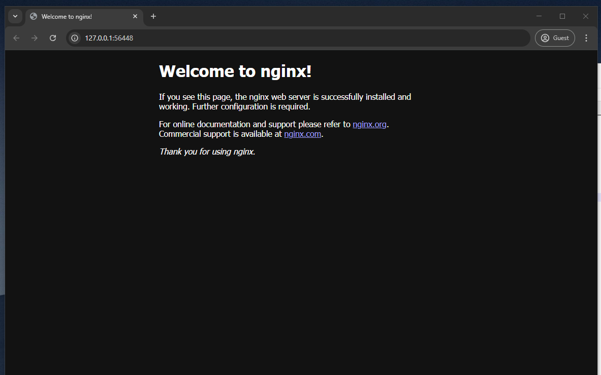

# Assignment 1: Deplying a webserver to a Kubernetes cluster and exposing it

I used minikube to create a local Kubernetes cluster and used deployment to run a nginx pod on it. I exposed port 80 on the webserver using a Kubernetes Service of type NodePort.

In order to use EKS, GKE, or AKS, make sure cli tools are installed and configured. 
Change context to the desired cluster using `kubectl config use-context <context-name>`.

If the cluster is running on a cloud provider, the service type can be changed to LoadBalancer to expose the webserver to the internet.

## Prerequisites

- Kubernetes cluster (MiniKube)
- Kubectl installed

## Installation

To deploy the webserver, run the following command:

```bash
kubectl apply -f deployment.yaml
kubectl apply -f service.yaml
```

## Verify the installation

To verify the installation, run:

```bash
kubectl get deployments
kubectl get pods
kubectl get services
```

## Access the webserver

To access the webserver, run:

```bash
minikube service my-nginx-service
```




