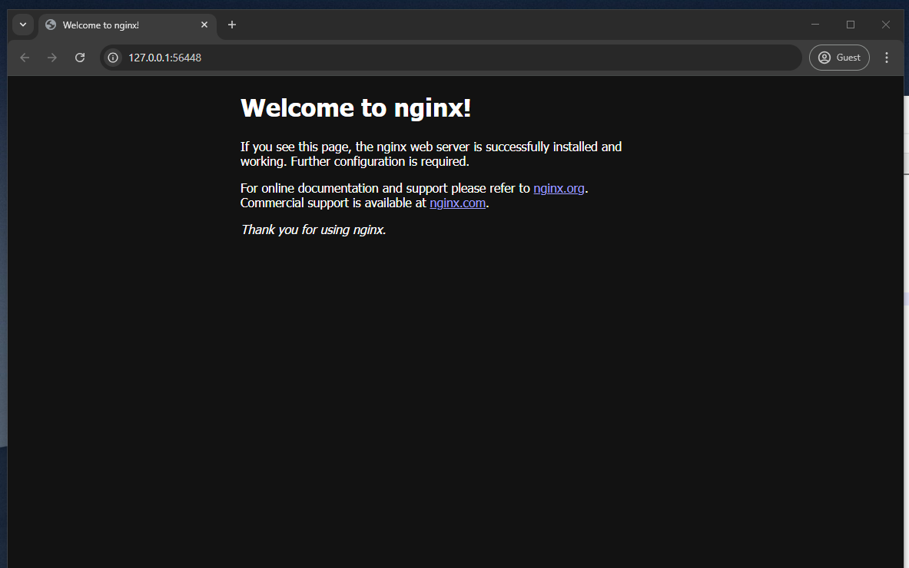

# Coding Challenge Submission

## Table of Contents

  - [1. Kubernetes Webserver Deployment](#1-kubernetes-webserver-deployment)
  - [1.2 Helm Charts](#12-helm-charts)
  - [2. Terraform Code](#2-terraform-code)


## 1. Kubernetes Webserver Deployment:

- Setup minikube on local machine, also install kubectl

- Start minikube using `minikube start --driver=docker`

- Deploy a webserver (nginx) using a deployment

```bash
kubectl apply -f deployment.yaml
```

```yaml
apiVersion: apps/v1
kind: Deployment
metadata:
  name: nginx-deployment
  labels:
    app: nginx
spec:
  replicas: 1
  selector:
    matchLabels:
      app: nginx
  template:
    metadata:
      labels:
        app: nginx
    spec:
      containers:
      - name: nginx
        image: nginx:latest
        ports:
        - containerPort: 80
```

- Expose the webserver to local host using a service of type NodePort

```bash
kubectl apply -f service.yaml
```

```yaml
apiVersion: v1
kind: Service
metadata:
  name: nginx-service
spec:
  type: NodePort
  selector:
    app: nginx
  ports:
    - protocol: TCP
      port: 80
      targetPort: 80
      nodePort: 30080
```

- Verify the deployment

```bash
kubectl get deployments
kubectl get pods
kubectl get services
```


- Access the webserver

```bash
minikube service nginx-service
```



---

## 1.2 Helm Charts:

This Helm chart deploys a containerized application (nginx) using Kubernetes. It includes a Deployment and a Service to manage the application.

- Directory structure:

```plaintext
nginx-helm-chart/
├── templates/
│   ├── deployment.yaml
│   ├── service.yaml
├── Chart.yaml
├── values.yaml
├── Helm-readme.md
```

#### Prerequisites

- Kubernetes cluster
- Helm installed

#### Package the chart

To package the chart, run the following command in the root directory of the chart:

```bash
helm package .
```

#### Installation

To install the chart, use the following command:

```bash
helm install my-nginx-release ./my-helm-chart
```

#### Configuration

To customize the deployment modify the `values.yaml` file.

#### Verify the installation

To verify the installation, run:

```bash
kubectl get deployments
kubectl get pods
kubectl get services
```


#### Uninstallation

To uninstall the chart, run:

```bash
helm uninstall my-nginx-release
```

---

## 2. Terraform Code:

Project structure:

```plaintext
Terraform/
├── main.tf
|── backend.tf
├── provider.tf
├── output.tf
```

- Provider used : AWS
- Backend : S3 bucket
- Resources : EC2 instance, Key Pair, S3 bucket, DynamoDB table
- Data : aws_instance.instance_id
- Output : Public IP of the EC2 instance, Instance ID

#### Prerequisites

- AWS account
- Terraform installed
- AWS CLI installed and configured

#### Initialize the working directory

```bash
terraform init
```

#### Plan the execution

```bash
terraform plan
```

#### Apply the changes

```bash
terraform apply
```

#### Verify the resources

```bash
terraform show
```

> - The S3 bucket (backend) has to be created before hand either manually or by using local backend while creating the bucket and then switching to S3 backend. 
> - To lock the state file, use DynamoDB table.
> - Enabled versioning on the S3 bucket to keep track of the changes.


#### Destroy the resources

```bash
terraform destroy
```

---

If any further explanation is required please feel free to ping me on my email (sahildeep.randhawa@gmail.com).

Thank you
